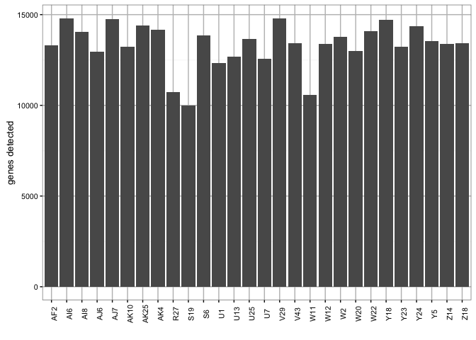
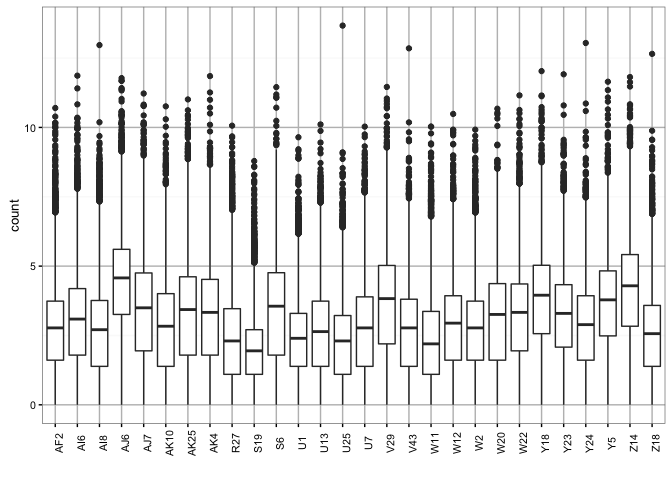
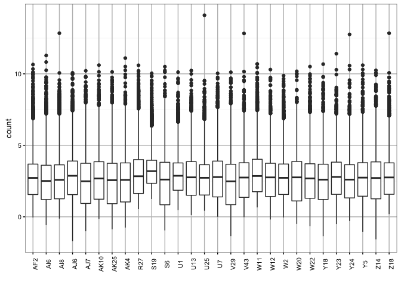
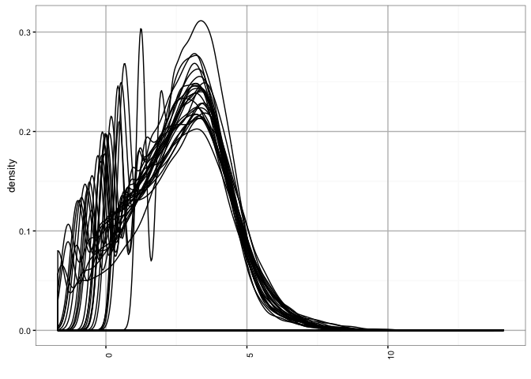
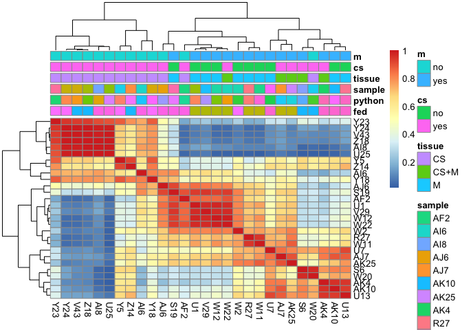
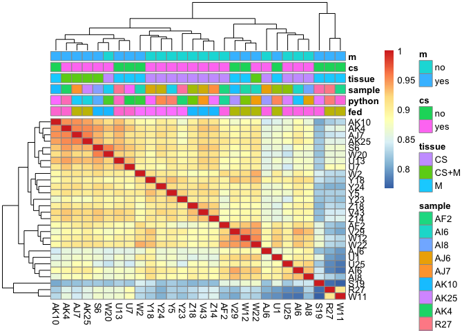
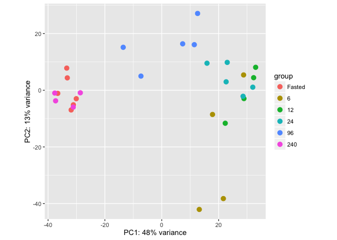

Overview
========

A description of what was done is [here](../../README.md). Briefly, we
downloaded the data, combined all of the technical replicates and ran
[bcbio-nextgen](https://bcbio-nextgen.readthedocs.org/en/latest/) in the
new fast RNA-seq mode that skips alignment and quality control and just
runs [Salmon](http://salmon.readthedocs.org/en/latest/) on the data.

    > basicConfig()
    > project_summary = "/Users/rory/cache/stylopoulos-python-rnaseq/python-paper-redo/2016-03-26_python-paper-redo/project-summary.csv"
    > counts_file = "/Users/rory/cache/stylopoulos-python-rnaseq/python-paper-redo/2016-03-26_python-paper-redo/combined.counts"
    > tx2genes_file = "/Users/rory/cache/stylopoulos-python-rnaseq/python-paper-redo/2016-03-26_python-paper-redo/tx2gene.csv"
    > cbPalette <- c("#999999", "#E69F00", "#56B4E9", "#009E73", "#F0E442", "#0072B2", 
    +     "#D55E00", "#CC79A7")
    > summarydata = read.table(project_summary, header = TRUE, sep = ",")
    > summarydata = summarydata[, colSums(is.na(summarydata)) < nrow(summarydata)]
    > # handle newer bcbio-nextgen runs that use description as the key
    > if ("description" %in% colnames(summarydata)) {
    +     rownames(summarydata) = summarydata$description
    +     summarydata$Name = rownames(summarydata)
    +     summarydata$description = NULL
    + } else {
    +     rownames(summarydata) = summarydata$Name
    +     summarydata$Name = NULL
    + }
    > summarydata = summarydata[order(rownames(summarydata)), ]
    > if (file.exists(tx2genes_file)) {
    +     sample_dirs = file.path("..", "..", rownames(summarydata))
    +     salmon_files = file.path(sample_dirs, "salmon", "quant.sf")
    +     sailfish_files = file.path(sample_dirs, "sailfish", "quant.sf")
    +     if (file.exists(salmon_files[1])) {
    +         loginfo("Using gene counts calculated from the Salmon transcript counts.")
    +         sf_files = salmon_files
    +     } else if (file.exists(sailfish_files[1])) {
    +         loginfo("Using gene counts calculated from the Sailfish transcript counts.")
    +         sf_files = sailfish_files
    +     }
    +     names(sf_files) = rownames(summarydata)
    +     tx2gene = read.table(tx2genes_file, sep = ",", row.names = NULL, header = FALSE)
    +     txi.salmon = tximport(sf_files, type = "salmon", tx2gene = tx2gene, reader = readr::read_tsv, 
    +         countsFromAbundance = "lengthScaledTPM")
    +     counts = round(data.frame(txi.salmon$counts, check.names = FALSE))
    + } else {
    +     loginfo("Using gene counts calculated from featureCounts.")
    +     counts = read.table(counts_file, header = TRUE, row.names = "id", check.names = FALSE)
    + }

    2016-03-29 00:24:04 INFO::Using gene counts calculated from the Salmon transcript counts.

    > counts = counts[, order(colnames(counts)), drop = FALSE]
    > colnames(counts) = gsub(".counts", "", colnames(counts))
    > write.table(counts, file = "counts.tsv", row.names = TRUE, col.names = TRUE, 
    +     quote = FALSE, sep = "\t")
    > 
    > # this is a list of all non user-supplied metadata columns that could appear
    > known_columns = c("Name", "X.GC", "Exonic.Rate", "Sequences.flagged.as.poor.quality", 
    +     "rRNA_rate", "Fragment.Length.Mean", "Intronic.Rate", "Intergenic.Rate", 
    +     "Mapping.Rate", "Quality.format", "Duplication.Rate.of.Mapped", "Mapped", 
    +     "rRNA", "Sequence.length", "Transcripts.Detected", "Mean.Per.Base.Cov.", 
    +     "Genes.Detected", "Unique.Starts.Per.Read", "unique_starts_per_read", "complexity", 
    +     "X5.3.bias", "Duplicates.pct", "Duplicates", "Mapped.reads", "Median.insert.size", 
    +     "Mapped.reads.pct", "Total.reads", "avg_coverage_per_region", "Mapped.Reads")

We'll further set two columns in the sample table, the first "cs"
indicates if the cs tissue should be in the sample and the second "m"
indicates if the m tissue should be in the sample.

    > summarydata$cs = ifelse(summarydata$tissue %in% c("CS", "CS+M"), "yes", "no")
    > summarydata$m = ifelse(summarydata$tissue %in% c("M", "CS+M"), "yes", "no")
    > metadata = summarydata[, !colnames(summarydata) %in% known_columns, drop = FALSE]
    > metadata = metadata[, colSums(is.na(metadata)) < nrow(metadata)]

Here we turn the `fed` column into a factor, and make sure that `fasted`
is the base level we compare to by setting it as the first level of the
factor.

    > summarydata$fed = factor(summarydata$fed, levels = c("Fasted", "6", "12", "24", 
    +     "96", "240"))
    > levels(summarydata$fed)

    [1] "Fasted" "6"      "12"     "24"     "96"     "240"   

    > # set seed for reproducibility
    > set.seed(1454944673)

    > get_heatmap_fn = function(summarydata) {
    +     # return the pheatmap function with or without metadata
    +     if (ncol(metadata) == 0) {
    +         return(pheatmap)
    +     } else {
    +         # rownames(metadata) = summarydata$Name
    +         heatmap_fn = function(data, ...) {
    +             pheatmap(data, annotation = metadata, ...)
    +         }
    +         return(heatmap_fn)
    +     }
    + }
    > heatmap_fn = get_heatmap_fn(summarydata)

Quality control metrics
=======================

    > qualimap_run = "Mapped" %in% colnames(summarydata)
    > do_quality = "Mapped.reads" %in% colnames(summarydata)

Number of genes detected
------------------------

    > dd = data.frame(Name = colnames(counts), Genes.Detected = colSums(counts > 0))
    > ggplot(dd, aes(x = Name, y = Genes.Detected)) + geom_bar(stat = "identity") + 
    +     theme_bw(base_size = 10) + theme(panel.grid.major = element_line(size = 0.5, 
    +     color = "grey"), axis.text.x = element_text(angle = 90)) + ylab("genes detected") + 
    +     xlab("")

Boxplot of log10 counts per gene
--------------------------------

    > melted = melt(counts)
    > colnames(melted) = c("sample", "count")
    > melted$sample = factor(melted$sample)
    > melted = melted[order(melted$sample), ]
    > melted$count = log(melted$count)
    > ggplot(melted, aes(x = sample, y = count)) + geom_boxplot() + theme_bw(base_size = 10) + 
    +     theme(panel.grid.major = element_line(size = 0.5, color = "grey"), axis.text.x = element_text(angle = 90)) + 
    +     xlab("")

Boxplot of log10 TMM-normalized counts per gene
-----------------------------------------------

Trimmed mean of M-values (TMM) normalization is described
[here](http://genomebiology.biomedcentral.com/articles/10.1186/gb-2010-11-3-r25)

Robinson, M. D., & Oshlack, A. (2010). A scaling normalization method
for differential expression analysis of RNA-seq data. Genome Biology,
11(3). <doi:10.1186/gb-2010-11-3-r25>

    > y = DGEList(counts = counts)
    > y = calcNormFactors(y)
    > normalized_counts = cpm(y, normalized.lib.sizes = TRUE)
    > melted = melt(normalized_counts)
    > colnames(melted) = c("gene", "sample", "count")
    > melted$sample = factor(melted$sample)
    > melted = melted[order(melted$sample), ]
    > melted$count = log(melted$count)
    > ggplot(melted, aes(x = sample, y = count)) + geom_boxplot() + theme_bw(base_size = 10) + 
    +     theme(panel.grid.major = element_line(size = 0.5, color = "grey"), axis.text.x = element_text(angle = 90)) + 
    +     xlab("")

Density of log10 TMM-normalized counts
--------------------------------------

    > ggplot(melted, aes(x = count, group = sample)) + geom_density() + theme_bw(base_size = 10) + 
    +     theme(panel.grid.major = element_line(size = 0.5, color = "grey"), axis.text.x = element_text(angle = 90)) + 
    +     xlab("")

Correlation (Pearson) heatmap of TMM-normalized counts
------------------------------------------------------

    > heatmap_fn(cor(normalized_counts, method = "pearson"))

Correlation (Spearman) heatmap of TMM-normalized counts
-------------------------------------------------------

    > heatmap_fn(cor(normalized_counts, method = "spearman"))

PCA plot
--------

We can see that the `240 hour` and `Fasted` samples look similar. The
largest differences are at the times directly after eating, and
`96 hours` is in between the fasted and eating state. It looks like
there are short term changes that gradually reset and last for \< 10
days with feeding.

    > dds = DESeqDataSetFromMatrix(countData = counts, colData = summarydata, design = ~Name)
    > vst = varianceStabilizingTransformation(dds)
    > plotPCA(vst, intgroup = c("fed"))

    > # snagged from development version of DESeq
    > DESeqDataSetFromTximport <- function(txi, colData, design, ...) {
    +     counts <- round(txi$counts)
    +     mode(counts) <- "integer"
    +     dds <- DESeqDataSetFromMatrix(countData = counts, colData = colData, design = design, 
    +         ...)
    +     stopifnot(txi$countsFromAbundance %in% c("no", "scaledTPM", "lengthScaledTPM"))
    +     if (txi$countsFromAbundance %in% c("scaledTPM", "lengthScaledTPM")) {
    +         message("using length scaled TPM counts from tximport")
    +     } else {
    +         message("using counts and average transcript lengths from tximport")
    +         lengths <- txi$length
    +         dimnames(lengths) <- dimnames(dds)
    +         assays(dds)[["avgTxLength"]] <- lengths
    +     }
    +     return(dds)
    + }
    > 
    > subset_tximport = function(txi, rows, columns) {
    +     txi$counts = txi$counts[rows, columns]
    +     txi$abundance = txi$abundance[rows, columns]
    +     txi$length = txi$length[rows, columns]
    +     return(txi)
    + }

    > library(DEGreport)
    > library(vsn)

All genes fluctuating with time
===============================

Now we can fit a model and do differential expression in a couple
different ways. The first thing we will do is answer the question "Is
there any genes that change with time after feeding, controlling for
their tissue composition?" We can do that by fitting two models, a full
model which takes the tissue composition and time after feeding into
account and a reduced model that just takes the tissue composition into
account. Then we can do a likelihood ratio test and answer the question
which genes are different due to time.

Set up the full and reduced model and create the DESeq2 dataset.

    > full_model = ~cs + m + fed
    > reduced_model = ~cs + m
    > counts = counts[rowSums(counts) > 0, ]
    > txi.salmon = subset_tximport(txi.salmon, rownames(counts), colnames(counts))
    > dds = DESeqDataSetFromTximport(txi.salmon, colData = summarydata, design = full_model)

Perform a likelihood ratio test, testing for differences between the
full and reduced model.

    > dds = DESeq(dds, test = "LRT", reduced = reduced_model)
    > res = results(dds)
    > sig = subset(res, padj < 0.05)
    > write.table(res, file = "time-dependent-changes.tsv", sep = "\t", col.names = TRUE, 
    +     row.names = TRUE, quote = FALSE)

We find 6072 genes that fluctuate with time, around half of all of the
genes that were expressed, that is quite a bit. We wrote the results for
all genes to a file
[time-dependent-changes.tsv](time-dependent-changes.tsv).

Specific timepoint comparisons
==============================

We can also do what was suggested in the Excel file, look at the
differences between specific timepoints. We again use the full model
fit, but instead of comparing it to the reduced model, we compare
specific timepoints to each other.

What was asked for was 7 contrasts:

1.  Fasted vs. 24 hrs
2.  Fasted vs. 24 hrs excluding SRS812446 (the only one that has M only)
3.  Fasted vs. 6 hrs
4.  Fasted vs. 96 hrs
5.  Fasted vs. 96 hrs excluding SRS812446 and SRS812468 (both include M
    only)
6.  Fasted vs. 240 hrs (we can omit entirely the analysis for this
    timepoint)
7.  Fasted vs. 12 hrs (we can omit entirely the analysis for this
    timepoint)

I think we can skip 2 and 5, we are controlling for whether or not the
sequenced sample had a cross section component or a mucosal component or
both in the analysis already, so that leaves us with 5 contrasts:

1.  Fasted vs. 6 hrs
2.  Fasted vs. 12 hrs
3.  Fasted vs. 24 hrs
4.  Fasted vs. 96 hrs
5.  Fasted vs. 240 hrs

We can do them in that order.

Fasted vs. 6 hours
------------------

    > dds = DESeq(dds)
    > res = results(dds, contrast = c("fed", "Fasted", "6"))
    > sig = subset(res, padj < 0.05)
    > write.table(res, file = "fasted-vs-6-hours.tsv", sep = "\t", col.names = TRUE, 
    +     row.names = TRUE, quote = FALSE)

There are 2539 genes differentially expressed between `Fasted` and
`6 hours` after feeding.

Results were written to [fasted-vs-6-hours.tsv](fasted-vs-6-hours.tsv).

Fasted vs. 12 hours
-------------------

    > res = results(dds, contrast = c("fed", "Fasted", "12"))
    > sig = subset(res, padj < 0.05)
    > write.table(res, file = "fasted-vs-12-hours.tsv", sep = "\t", col.names = TRUE, 
    +     row.names = TRUE, quote = FALSE)

There are 2925 genes differentially expressed between `Fasted` and
`12 hours` after feeding.

Results were written to
[fasted-vs-12-hours.tsv](fasted-vs-12-hours.tsv).

Fasted vs. 24 hours
-------------------

    > res = results(dds, contrast = c("fed", "Fasted", "24"))
    > sig = subset(res, padj < 0.05)
    > write.table(res, file = "fasted-vs-24-hours.tsv", sep = "\t", col.names = TRUE, 
    +     row.names = TRUE, quote = FALSE)

There are 4031 genes differentially expressed between `Fasted` and
`24 hours` after feeding.

Results were written to
[fasted-vs-24-hours.tsv](fasted-vs-24-hours.tsv).

Fasted vs. 96 hours
-------------------

    > res = results(dds, contrast = c("fed", "Fasted", "96"))
    > sig = subset(res, padj < 0.05)
    > write.table(res, file = "fasted-vs-96-hours.tsv", sep = "\t", col.names = TRUE, 
    +     row.names = TRUE, quote = FALSE)

There are 1985 genes differentially expressed between `Fasted` and
`96 hours` after feeding.

Results were written to
[fasted-vs-96-hours.tsv](fasted-vs-96-hours.tsv).

Fasted vs. 240 hours
--------------------

    > res = results(dds, contrast = c("fed", "Fasted", "240"))
    > sig = subset(res, padj < 0.05)
    > write.table(res, file = "fasted-vs-240-hours.tsv", sep = "\t", col.names = TRUE, 
    +     row.names = TRUE, quote = FALSE)

There are 0 genes differentially expressed between `Fasted` and
`240 hours` after feeding.

Results were written to
[fasted-vs-240-hours.tsv](fasted-vs-240-hours.tsv).

Wrap-up
-------

We broadly recapitulate the results of the paper, at least in terms of
number of genes differentially expressed at each timepoint.
